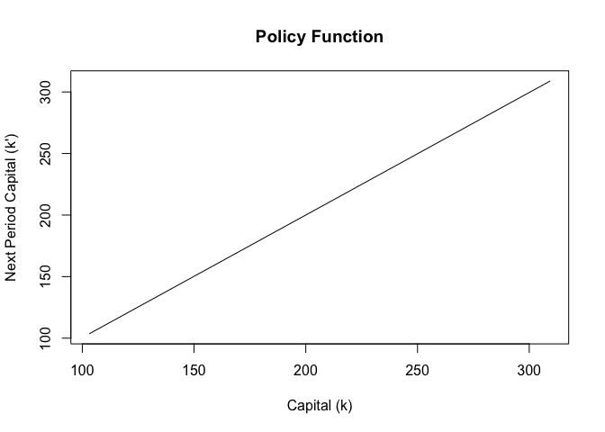

<!-- README.md is generated from README.Rmd. Please edit README.Rmd -->

# neogro

`neogro` is an R package that implements fast C++ (via Rcpp) solvers for
the **deterministic neoclassical growth model** using value function
iteration. The package provides tools to compute value and policy
functions for a standard Cobb–Douglas economy.

## Installation

You can install the development version from GitHub:

``` r
# install.packages("devtools")
devtools::install_github("trekonom/neogro")
```

``` r
library(neogro)

# Solve the model with default parameters
result <- neogro()
```

    ## Steady-state capital stock: 206.269
    ## iteration over value function: 366 error: 9.87148e-06

``` r
# View the first few rows
head(result)
```

    ##          k     kopt     copt      iopt        y         ropt      vopt
    ## 1 103.1347 103.5800 3.216989 0.4453067 3.662296 -0.007747908 -44.64104
    ## 2 104.1713 104.6123 3.231504 0.4410609 3.672564 -0.007605539 -44.54028
    ## 3 105.2078 105.6446 3.245952 0.4368078 3.682760 -0.007467003 -44.44042
    ## 4 106.2443 106.6769 3.260341 0.4325424 3.692884 -0.007329606 -44.34145
    ## 5 107.2809 107.7091 3.274667 0.4282693 3.702936 -0.007194806 -44.24335
    ## 6 108.3174 108.7414 3.288931 0.4239877 3.712919 -0.007062065 -44.14611

``` r
# Plot the policy function
plot(
  result$k,
  result$kopt,
  type = "l",
  main = "Policy Function",
  xlab = "Capital (k)",
  ylab = "Next Period Capital (k')"
)
```

<!-- -->
